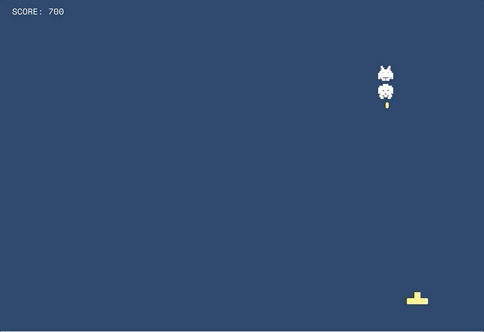

# SEI-23 Project 1 - Alien Invaders

<a href="https://izzycsy.github.io/proj1-alienInvaders/">Alien Invaders</a>

### Game: 
An adaptation of coin-op video arcade game Space Invaders. The goal is to defeat a wave of descending swarm of aliens, using a horizontal moving spaceship, firing at as many aliens possible.

### MVP:
- Game to display in browser
- Incorporate HTML, CSS, and JavaScript files
- Canvas of 800 x 600 px (w x h)
- A spaceship (the player) and 3 rows of aliens
- Spaceship to shoot aliens
- Aliens to move downwards as game proceeds
- DOM manipulation which allows scripts to dynamically access content, structure and style of documents; updating the data of the page without the need to refresh

### Other Features:
- Typography to reflect pixel-like game
- Score reflected when alien is shot
- If bullet misses alien, game continues 
- Game auto-start, pause, over-playerWin
- Game restart

### Game Play
- Game Instruction

- Sneakpeak of game

### Future Plans
Increased difficulty: 
- Aliens to shoot back at player
- DIY obstables
- Add gameover-lose
- Responsive screen size
- Better UI

### Workflow
- Build components of game into smaller segments before piecing them together
- Components: GameCanvas, player, spaceship, aliens, bullets, scoring, restart

#### Authors & Acknowledgment:
- Daniel Schiffman coding train <a href="https://www.youtube.com/watch?v=KnUqSQAHQSg">challenge</a>
- Daniel Kaye coding  <a href="https://editor.p5js.org/danno484/sketches/zzO5nmnEg">challenge</a>
- <a href="https://p5js.org/">p5.js Editor</a>